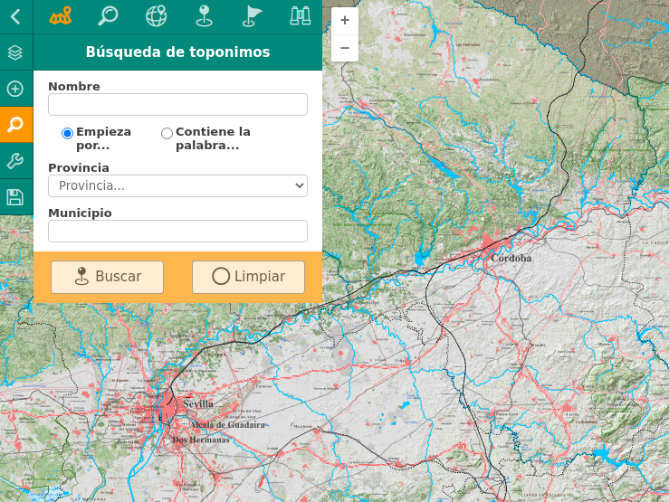

# M.plugin.Sidepanel

Plugin contenedor diseñado para agrupar otros plugins en su interior, de modo que se presenten en una interfaz compacta y replegable. 

Los plugins que se deseen integrar deben cumplir una serie de requisitos:

- Deben disparar el evento M.evt.ADDED_TO_MAP cuando finalicen su método addTo(map).
- Sus estilos deben encajar en la interfaz de sidepanl, o ser ajustados desde este último.

Se incluyen en el directorio "/test" de la distribución de este sidepanel los binarios de muchos plugins externos que son compatibles, para que el desarrollador pueda ver un ejemplo completamente funcional, pero no son necesarios.



# Dependencias

- sidepanel.ol.min.js
- sidepanel.ol.min.css


```html
 <link href="../../plugins/sidepanel/sidepanel.ol.min.css" rel="stylesheet" />
 <script type="text/javascript" src="../../plugins/sidepanel/sidepanel.ol.min.js"></script>
```

# Parámetros

El constructor se inicializa vacío, y una vez se añada al mapa, se le pueden añadir los plugins deseados agrupados en **grupos** inicializándolos con sus parámetros correspondientes y con un valor entero que represente el orden de las pestañas

```javascript
var sp = new Sidepanel();
sp.on(M.evt.ADDED_TO_MAP, () => {
    sp.addGroup({
        icon: "g-cartografia-mas2",
        title: "Título del grupo de plugins",
        order: 1,
        plugins: [
            { plugin: new M.plugin.Plugin1(), order: 1 },
            { plugin: new M.plugin.PLugin2(), order: 2 }
        ]
    });
    sp.addGroup({...});
```  
El plugin [managelayers](https://github.com/sigcorporativo-ja/managelayers) representa un caso particular y puede añadirse directamente al sidepanl como plugin.

El test de ejemplo de este repositorio contiene un ejemplo funcional completamente operativo con múltiples agrupaciones y plugins, así como plugins externos.  